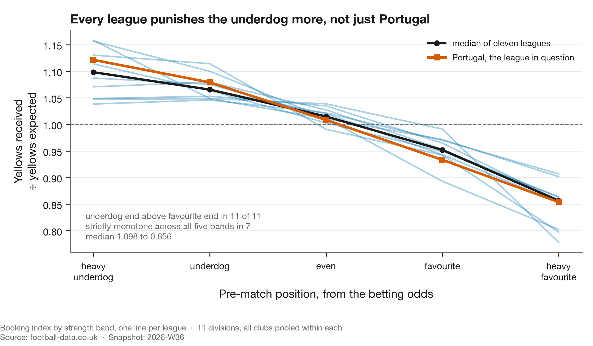
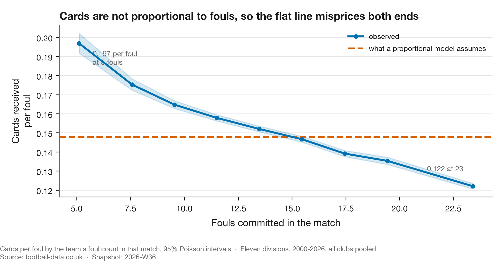
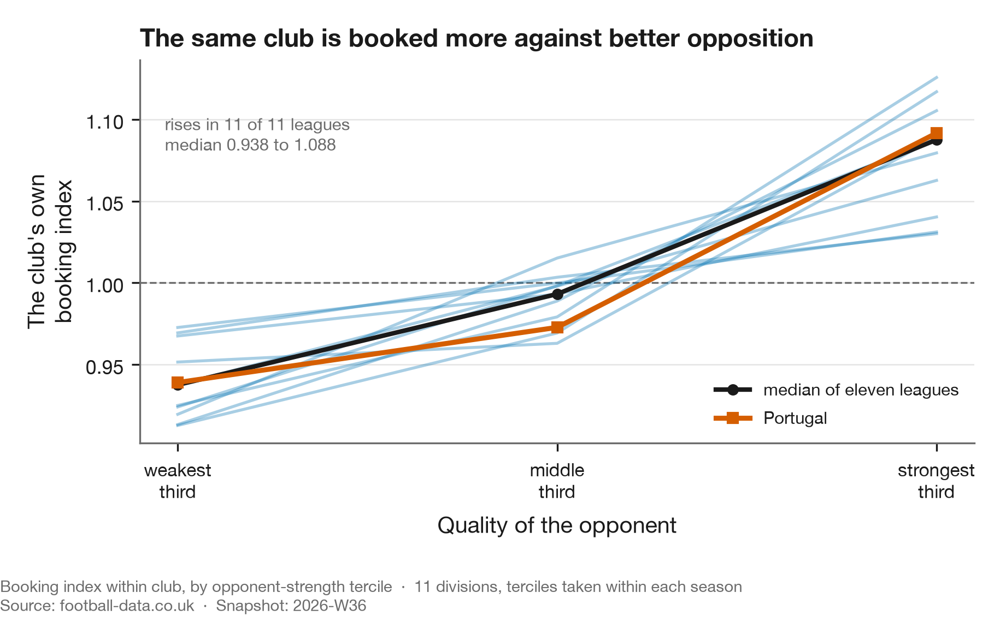
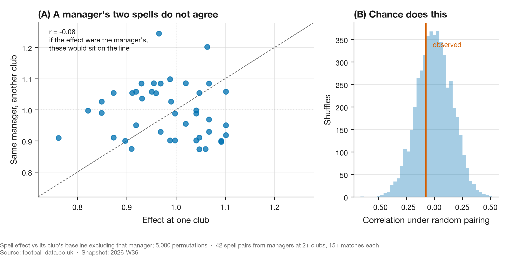
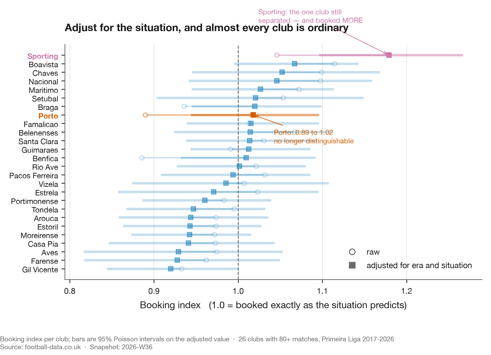
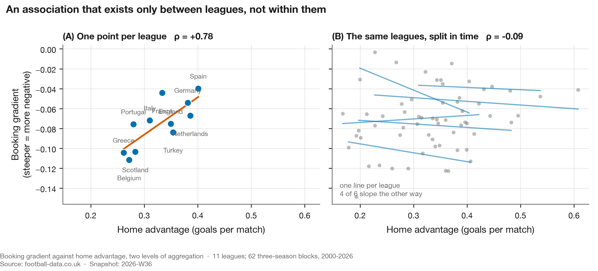

# A club that fouls with impunity, and the four ways I was wrong about it

**Published:** 2026-08-30 · **Data:** `2026-W35`, with the season in progress from `2026-W36` · **Claim level:** L2 (hypothesis, adjusted)

---

## What the data says

Across eleven European leagues, how often a team is booked per foul it commits depends mostly on
how strong that team was expected to be that afternoon. Heavy underdogs are booked more, heavy
favourites less, in all eleven leagues, and no club identity is involved.

In the Portuguese league, once you account for that, for the era and for the referee who was
actually appointed, one club of twenty-six is booked measurably more than expected. It is Sporting,
at 1.18. Porto and Benfica both sit at 1.00, indistinguishable from average.

A post had gone around implying Porto were being favoured by referees. That is where the question
came from, and it is the last time the post appears here. The claim is the object of study; the
person who made it is not, so it is neither linked nor named. See [`EDITORIAL.md`](../../EDITORIAL.md).

## The pre-registered question

> Is there a measurable difference in how often a given club is booked, relative to the fouls it
> commits?

Written before the data was pulled. What follows reports what happened, including the parts where
the answer changed under its own tests.

## The metric

**Booking index** `LITERATURE-adjacent, COINED in this form`. Yellow cards received, divided by
yellow cards expected from the team's own foul count. An index of 1.0 means booked exactly as
often as the fouls imply.

The underlying quantity — cards conditioned on fouls — is standard. Phatak et al. (2021) use
fouls-per-card across five leagues. The name and the specific expectation model here are mine, and
neither appears in the literature under this label. Treating it as an established measure would be
a mistake.

## The first answer, which looked good and was wrong

Porto's raw booking index comes out at **0.890**. Comfortably below 1.0, interval excluding it.
Benfica sits at 0.885. On its face, two clubs booked around 12% less than their fouls imply.

That is roughly the shape the original claim predicted. It is also wrong three times over.

## Wrong (1): most of it is being the favourite


Booking rate per foul depends heavily on how strong you were expected to be in that specific
match. In Portugal, the league the question was about and the one the figure shows, a heavy
underdog is booked at **1.121** times its foul count and a heavy favourite at **0.854**. A 31%
swing, with no club identity involved.



The pattern is not Portuguese. The underdog end sits above the favourite end in **all eleven
leagues**, median 1.098 against 0.856. Per-league bands are in
[`story.json`](story.json), alongside every other number this study's figures carry.

Strict monotonicity across all five bands holds in seven of them. Germany, France, Italy and Spain
each tick up by less than 0.01 between the two underdog bands, which are also their smallest
samples. The direction is everywhere; the perfectly clean staircase is not.

Dominant clubs are favourites most weeks. So roughly half of Porto's apparent leniency was being
the better side, which they share with every strong club in Europe.

## Wrong (2): the expectation model was misspecified

The expectation assumed cards are proportional to fouls: *expected = rate × fouls*. They are not.



Fitting `cards = a + b × fouls` per league-season gives an intercept worth 13% to 47% of mean
cards, depending on the competition. Observed cards per foul falls monotonically across the range,
from 0.197 in matches where a side commits six fouls or fewer to 0.122 where it commits more than
twenty. Every bin is in [`story.json`](story.json).

That intercept is interpretable. It is the cards that have nothing to do with your foul count:
dissent, delaying the restart, entering the field of play, simulation, plus whatever the data feed
does or does not record as a foul. In Greece and Italy it is nearly half of all cards.

Forcing the line through the origin inflates every low-foul team and deflates every high-foul team,
with no behaviour involved. A test on synthetic teams with identical card processes shows the
proportional model inventing a gap of over 0.10 between them.

Dominant clubs foul less than average. The model was flattering exactly the clubs the finding was
about.

## Wrong (3): the effect is not the club's

This is the one that changed the conclusion, and the test is embarrassingly cheap. Compute the same
index for the **opponents**.

| | |
|---|---|
| corr(club strength, **own** adjusted index) | **+0.484** |
| corr(club strength, **opponents'** index) | **+0.283** (p = 7×10⁻⁶) |
| corr(own index, opponents' index) | +0.116 (p = 0.07) |

All three from `scripts/strength_effect.py`, recorded in
[`strength_effect.json`](strength_effect.json).

When a dominant club plays, the other team is booked more per foul too, and the two are close to
independent. A club-level story predicts the second correlation is zero. It is not.

The within-club version is cleaner still. Holding the club fixed and splitting its own matches by
opponent quality:



| Opponent | Portugal | Median of eleven leagues |
|---|---|---|
| Weakest third | 0.939 | 0.938 |
| Middle third | 0.973 | 0.993 |
| **Strongest third** | **1.092** | **1.088** |

It rises in **11 of 11** leagues. Club identity is differenced out here, so this is the same side,
playing the same way, booked differently according to who is at the other end of it.

So the correct statement is not *"dominant clubs are booked more."* It is:

> Cards per foul scale with the quality of the fixture, for both teams.

A club's own quality is half of that fixture quality, so strong clubs genuinely do see a higher
rate. They are not being singled out. They are playing in higher-quality matches, and those
matches produce more cards per foul.

## If not the club, then the manager?



The natural next candidate. Managers set how a side presses and how it fouls, and Portuguese clubs
change them often enough to test it: take every manager who worked at two or more clubs, measure
each spell against that club's own baseline excluding them, and see whether the two spells agree.

They do not. Across 42 spell pairs the correlation is **r = −0.076**, and a permutation test that
reshuffles which spell belongs to which manager gives **p = 0.628**. The observed value sits in the
middle of the null. A manager who runs a disciplined side at one club is no more likely than chance
to do it at the next.

Between-manager variance accounts for about 12% of the spread in spell effects, which is small
enough that the honest reading is that this data cannot see a manager effect, rather than that none
exists. Either way, the club-level story does not become a manager-level story. Every number in this
section is in [`manager_travel.json`](manager_travel.json).

## Wrong (4), sort of: someone got there first

Dawson, Dobson, Goddard and Wilson published a gradient in cards by team strength in 2007
(*JRSS-A* 170(1)), on 2,660 Premier League matches, with a Nash-equilibrium model of aggression.
Their reduced form is a subset of the one used here.

What may be new is conditioning on fouls: asking not "who gets more cards" but "who gets more
cards for the same number of fouls". Rediscovering a known result on twenty-two times the data is
worth doing. Presenting it as new is not.

## So: was the club being favoured?

On this measure, no.

Portugal has no referee data in the standard source, so we assembled it. 2,737 match-official rows
across ten seasons, 98.4% joined to our matches and validated on scorelines rather than names.
Portuguese referees vary as much as English ones, with booking multipliers from 0.75 to 1.32 among
the 32 with 40+ matches, but that variation is not concentrated on anyone. Every club's mean
referee draw falls between 0.971 and 1.021.

Each club is judged against officials measured without that club. Otherwise a side that draws one
official often helps set the baseline it is being judged against, and a real effect partly cancels
itself.

Adjusting for era, match situation and the actual official on the pitch:

| Club | Booking index | 95% interval |
|---|---|---|
| **Sporting** | **1.177** | [1.094, 1.264] |
| Benfica | 1.002 | [0.925, 1.084] |
| Porto | 1.002 | [0.929, 1.079] |

Produced by `scripts/portugal_referee_table.py`, with all 26 clubs in
[`referee_table.json`](referee_table.json).

Porto sit at 1.002, indistinguishable from average. One club of twenty-six separates from
expectation, and it is not the one in the original claim.



The figure shows the era-and-situation step only, which is why Porto reads 1.02 there against 1.00
in the table: the referee adjustment moves them slightly further down. The shape is the point.
Almost every club that looked unusual on the raw index stops looking unusual once the situation is
accounted for, and the hollow-to-solid movement is the size of that correction.

### The multiplicity check, which is where most of these die

Testing twenty-six clubs and reporting the extreme one is how you manufacture a finding. One club
clears an uncorrected p < 0.05, and the next two sit just outside it.

Under a Benjamini–Hochberg screen at FDR 0.10, one survives:

| Club | Index | raw p | BH-adjusted | Bonferroni |
|---|---|---|---|---|
| Sporting | 1.177 | 0.00002 | **0.0004** | **0.0004** |
| Gil Vicente | 0.928 | 0.081 | 0.635 | 1.000 |
| Boavista | 1.062 | 0.090 | 0.635 | 1.000 |

These p-values are two-sided, computed by the script alongside the table. They were previously
typed in by hand and cannot be reproduced from any method recorded here, which is why they moved:
the runner-up used to read 0.044 and now reads 0.081. Two-sided is the convention the 95% interval
above already assumes, and no direction was specified in advance for a club sitting *below*
expectation, so the screen and the interval now agree about which clubs are extreme.

Gil Vicente is the one a naive threshold would have published. Sporting survives Bonferroni too,
which is the conservative correction and not one this result needed.

### What this cannot say

It measures yellow cards relative to fouls committed and nothing else. It says nothing about
penalties given or denied, offside calls, disallowed goals, red cards specifically, added time, or
whether any individual decision was correct. If "favoured" means those things, this analysis is
silent on it and should not be quoted as though it were not.

A high index is also not misconduct. Sporting commit fouls that draw cards more often than their
foul count predicts. Why is a separate question this data cannot answer.

## What happens next, and what the index is worth

Two questions this report raises are answered elsewhere, because neither is about Porto.

**The season in progress** has its own page, [the Portuguese season as it
stands](../live-season-portugal/report.md). It is deliberately not part of this report: a live test
with a resolution date in November would leave a dated document permanently unfinished, and the
pre-registration deserves a surface that is expected to change.

**Whether a one-season booking index means anything at all** is [study
04](../04-how-much-of-an-index-is-real/report.md). It has to be asked, because Sporting separating
and Porto not is only interesting if the measure carries a club property in the first place. It
does, and it is small: 15% of the spread between clubs in a season is real and the rest is the
Poisson noise of one season's cards.

## The data lesson

The version that transfers, and the reason this report is in a repository about method rather than
about football: **when a metric is an average over a group, ask whether the effect belongs to the
group or to the situations the group is in.** Cohorts, segments, cost centres, model slices. The
arithmetic is identical and so is the error.

Every attack run against this finding, and the two that killed part of it, are in the table below.

## Pressure tests

`METHODS.md` §11 attacks a finding on six fronts before it is published. The point of tabulating
them is that an attack never tried cannot pass as one tried and survived.

| Attack | Status | What happened |
|---|---|---|
| Specification | **run — landed** | The expectation was `cards = rate x fouls`, proportional through the origin. Measured, the intercept is 13% to 47% of mean cards by league. Because dominant clubs foul *less*, that misspecification inflated exactly the clubs the finding was about. |
| Aggregation | **run — landed** | Recomputed the index for the *opponents*. It moves with the club's, so the effect belongs to the fixture. This is Wrong (3). |
| Adjustment coarseness | **run — survived** | Five strength bands under-corrected the strongest clubs. Redone as a continuous fit; the association strengthened. |
| Prior work | **run — landed** | Dawson, Dobson, Goddard and Wilson (2007) published a strength gradient in cards. What may be new here is conditioning on fouls, not the gradient. |
| Baseline sufficiency | **run — survived** | Asked and answered in [study 04](../04-how-much-of-an-index-is-real/report.md), which resamples the booking index from a world where clubs differ in nothing and finds the observed carry-over far outside it. The numbers live there rather than being restated here. |
| Cross-sectional, few units | **run — landed** | The home-advantage explanation correlates at +0.782 across eleven league averages and −0.086 within leagues over time. One dataset, three aggregation levels, and the coarsest one manufactured it. |

Two of the six killed something. Both deaths are in the body of this report rather than in a
footnote, because the deaths are the finding.

## Tri-anchor

| Anchor | Source |
|---|---|
| **Data** | 58,013 completed-season matches across 11 leagues, 2000–2025, committed snapshot `2026-W35`, plus 2,737 Portuguese match officials |
| **Football** | Dawson et al. (2007) on referee inconsistency and the strength gradient; Phatak et al. (2021) on fouls-to-cards across leagues |
| **Data science** | Efron & Morris (1975) on shrinkage; Benjamini & Hochberg (1995) on multiplicity |

## References

- Dawson, P., Dobson, S., Goddard, J. & Wilson, J. (2007). Are Football Referees Really Biased and
  Inconsistent? *JRSS-A* 170(1), 231–250. [doi:10.1111/j.1467-985X.2006.00451.x](https://doi.org/10.1111/j.1467-985X.2006.00451.x)
- Phatak, A., Rein, R. & Memmert, D. (2021). The Dirty League. *J. Human Kinetics* 80, 263–276.
  [doi:10.2478/hukin-2021-0095](https://doi.org/10.2478/hukin-2021-0095)
- Efron, B. & Morris, C. (1975). Data Analysis Using Stein's Estimator. *JASA* 70(350), 311–319.
  [doi:10.1080/01621459.1975.10479864](https://doi.org/10.1080/01621459.1975.10479864)
- Benjamini, Y. & Hochberg, Y. (1995). Controlling the False Discovery Rate. *JRSS-B* 57(1),
  289–300. [doi:10.1111/j.2517-6161.1995.tb02031.x](https://doi.org/10.1111/j.2517-6161.1995.tb02031.x)

## Open questions

**Sporting.** The one club still separating, at 1.177 across three managers and with no unusual
referee draw. Nobody was arguing about Sporting, which is part of why it is interesting.

**Absolute versus relative quality: tested, and still open.** Our strength measure is standardised
within league, so a Celtic–St Mirren fixture scores as "high quality" on the same scale as
Barcelona–Getafe. The gradient does vary a lot between leagues, from −0.040 in Spain to −0.110 in
Belgium, and that variation is real rather than noise: 91% of it survives correcting for how
precisely each league's gradient is estimated.

Absolute quality looked like the explanation and is not. Against UEFA association coefficients the
gradient correlates at +0.61, but the association does not survive controlling for home advantage
(+0.50, p = 0.14). Home advantage itself correlates at +0.79 across the eleven leagues, which is
stronger, stable under leave-one-out, and survives correcting for having tried seven league-level
covariates.

It is also an artifact of aggregation.



Splitting the same data into three-season blocks and asking whether a league's own gradient moves
when its own home advantage moves gives **−0.086, p = 0.50**, with the slope running the other way
in five of the six leagues that have enough blocks to fit one. The test can detect a correlation of
0.35 at 80% power, so it is not simply underpowered against a claimed 0.79.

| Unit | n | correlation |
|---|---|---|
| League averages | 11 | **+0.782** |
| Three-season blocks, pooled | 62 | +0.238 |
| Three-season blocks, within league | 62 | **−0.086** |

Produced by `scripts/aggregation_levels.py`, with each league's own slope in
[`aggregation.json`](aggregation.json).

Home advantage fell across the panel from 0.349 goals per match in 2001 to 0.220 in 2025, with the
crowd-free seasons visible as a trough. The gradient did not follow it.

So the question stays open, and the aggregation lesson is the same one as Wrong (3) above: a
correlation across eleven leagues is a correlation between eleven things that differ in many ways
at once. This is exploratory rather than pre-registered, and it is recorded here as a question not
answered rather than as a finding.

**What we cannot resolve at all.** Whether the same foul is punished more harshly in a bigger
match, or whether bigger matches simply contain more cardable fouls. Distinguishing those requires
foul-level video coding. That is the honest limit here.

## Reproduce this

```bash
uv run python scripts/build_discipline_story.py   # figures 1-7, and the club table
uv run python scripts/aggregation_levels.py       # figure 8, the aggregation test
uv run python scripts/strength_effect.py          # the cross-league association
uv run python scripts/portugal_referee_table.py  # the club table above
uv run python scripts/referee_decomposition.py
uv run python scripts/manager_travel.py
```
