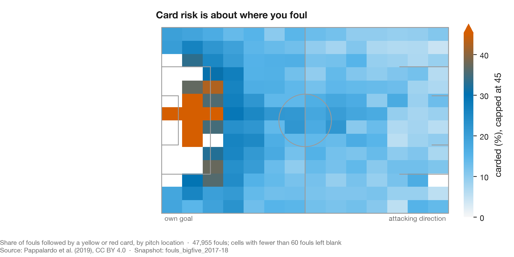
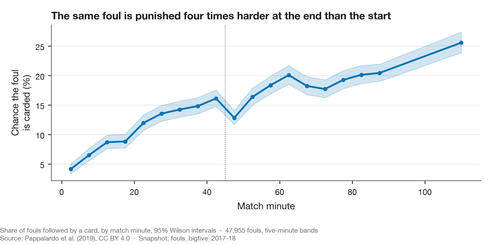
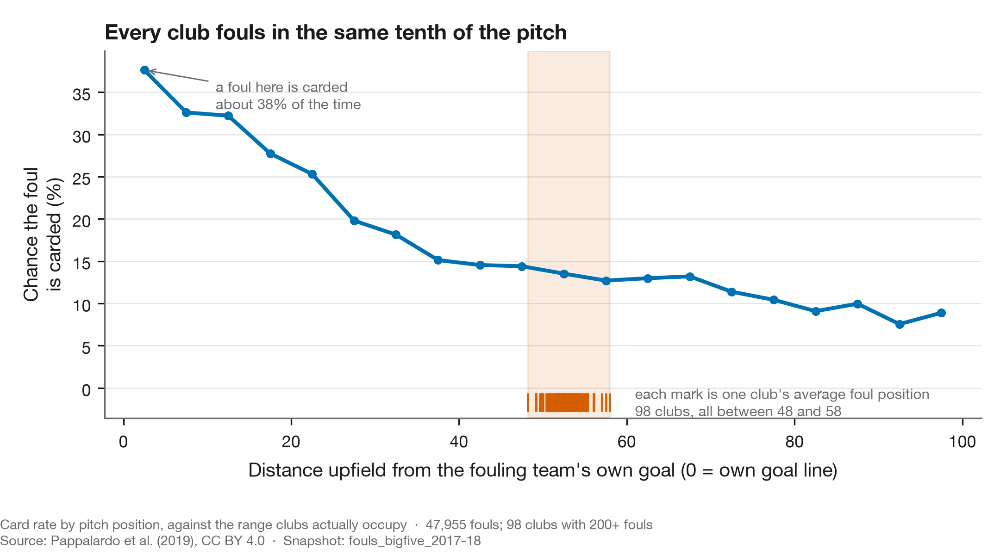
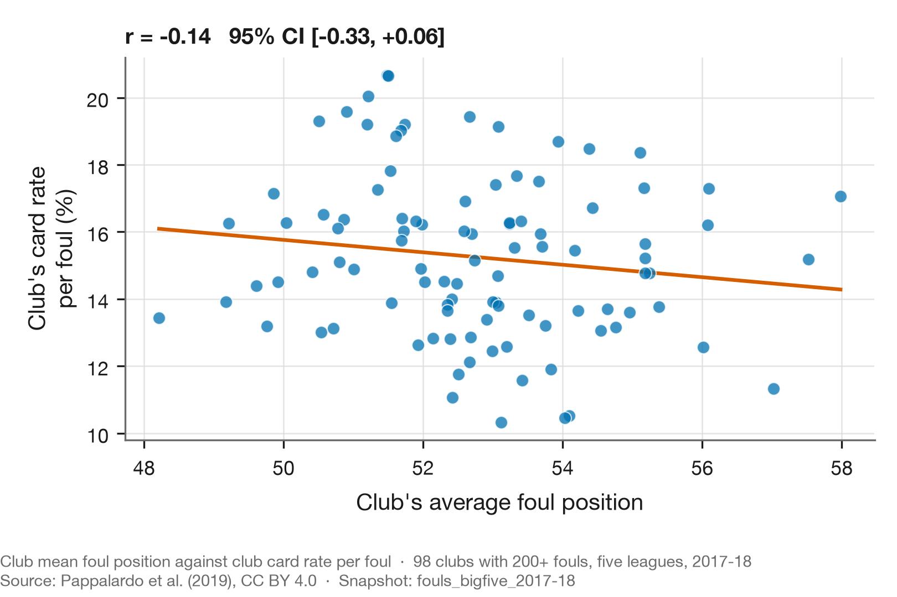

# The lever nobody pulls

**Published:** 2026-08-31 · **Updated:** 2026-09-06 · **Data:** `fouls_bigfive_2017-18` · **Claim level:** L1 (descriptive)

---

## What the data says

Whether a foul is punished depends enormously on where and when it happens. A foul in your own
defensive fifth is carded **31.4%** of the time; the same offence in the attacking fifth, **8.9%**.
A foul in the opening quarter of an hour is carded **6.5%** of the time; after ninety minutes,
**25.6%**.

That is a large, exploitable difference, and it is not exploited. Across 98 clubs in five leagues,
the average position of a club's fouls spans **48 to 58** on a hundred-point pitch, a tenth of the
range over which the gradient is measured. Where a club fouls predicts a little of how often it
is carded: the share of its fouls in its own third accounts for about **9%** of the between-club
spread in card rate, and nothing else tried here does better.

The lever is real. Nobody appears to be pulling it hard.

## Where this question came from

Study 02 found that a club's booking index is a persistent property, repeating season to season at
r = +0.32 across eleven leagues. Something club-level is stable. The obvious candidate is that
clubs differ in *which* fouls they commit, and that the good ones foul where cards are cheap.

That mechanism was unverifiable here until recently, because football-data.co.uk records fouls as a
count and nothing else. It is testable now because a peer-reviewed, openly licensed source of
foul-level data exists, which this project had wrongly recorded as not existing. See
[`DATA_SOURCES.md`](../../DATA_SOURCES.md).

**This analysis was not pre-registered.** It is exploratory, the question was formed after seeing
study 02's persistence result, and it is reported at L1 accordingly.

## The metric

**Card rate per foul** `LITERATURE`. The share of fouls followed by a yellow or red card. Azmat and
Yi (2024) model the same quantity at the level of an individual foul and call it expected booking;
this report uses observed rates rather than a fitted model, so nothing here is their xB.

## 1. Where you foul



The map is drawn in the fouling team's attacking direction, so the left edge is their own goal
line. Card risk concentrates hard in front of goal and falls away steadily upfield. Central fouls
draw **19.0%** against **13.0%** out wide.

None of that is surprising in direction. The size is: a threefold difference between one end of the
pitch and the other, on the same nominal offence.

## 2. When you foul



The rise across a match is steeper than the spatial effect: roughly fourfold from the opening
minutes to stoppage time.

The interesting part is the discontinuity. Card rate climbs through the first half to **16.1%** in
its final five minutes, then **drops to 12.8%** in the first five minutes of the second. A 3.3
point fall across the interval, p = 4×10⁻⁴.

Whatever accumulates within a half is therefore partly discharged at the interval. That rules out
anything monotonic in elapsed time, fatigue included, and leaves both referee escalation and a
genuine change in how teams play. These data do not separate them, and the search that would
establish whether the reset is already documented could not be run.

## 3. What state you are in

| Fouling team | Card rate |
|---|---|
| Behind | **18.1%** |
| Ahead | 16.2% |
| Level | **13.3%** |

Teams are treated more harshly when losing than when level. That is confounded in an obvious way:
a team chasing a game fouls differently, not just more. Nothing here separates the referee's
response from the team's behaviour.

## 4. The gradient is steep, and every club stands in the same place



This is the result. The card-rate gradient runs the length of the pitch. Club averages occupy
**48 to 58** of it.

Context matters enormously to whether *a* foul is carded. It barely matters to whether *a club* is
carded more than another. Position, minute and score state together explain
**3.1%** of the spread in yellows per foul between clubs.

That is the whole finding in one number, and it is not a contradiction of the sections above. A
gradient can be steep and still explain nothing between actors, provided the actors all stand in
the same place on it.



A club's mean foul position against its card rate gives **r = −0.14, 95% interval [−0.33, +0.06]**.
The sign points the way the mechanism predicts and that is all that can be said for it. The test
can find a correlation of 0.28 at 80% power, so a moderate relationship is ruled out and a small
one is not.

Clubs do differ genuinely in **where** they foul: 70% of the between-club variation in mean foul
position survives correcting for the sampling error of a club average. They barely differ in
**when**, at 14%. Moving from the worst to the best observed foul mix would be worth about **18%**
of the base card rate.

## 5. The statistic other people use

Section 4 summarises where a club fouls by the mean position of its fouls. That is not how the
question is put in public. On 6 September 2026, answering the same Portuguese booking argument
this project began with, the analytics outlet GoalPoint proposed fouls in the defensive third per
match as the first thing a fouls-to-cards comparison leaves out. That is a tail share, not a mean,
and the gradient is steepest in that tail, so it deserves its own test rather than an assumption
that the mean already covers it.

By thirds of the pitch, the card rate per foul is **24.1%** in the fouling team's own third,
**14.0%** in the middle and **10.6%** in the attacking third. The own-third share of a club's
fouls runs from **16.1%** to **29.9%** across the 98 clubs.

It does better than the mean. Own-third share against card rate per foul gives
**r = +0.30, 95% interval [+0.10, +0.47]**, where the mean position gave −0.14 and could not be
separated from zero. Squared, that is **8.8%** of the between-club variation in card rate, against
the **3.1%** the full context model explained in section 4. The lede has been changed to say so.
The direction of the finding has not: nine tenths of the spread between clubs is still not where
they foul.

Asked the way it is asked in public, as a per-match count, the statistic stops adding anything.
Own-third fouls per match against cards per match correlates at **0.67** [0.54, 0.77]. Plain fouls
per match against cards per match correlates at **0.70** [0.58, 0.79]. A club that fouls more
fouls more in its own third too, and the per-match count is mostly counting fouls. The share is
the informative form; the count is a proxy for volume. Club-seasons run from **1.76** to **4.32**
own-third fouls per match, median **3.07**, so a single club a few matches into a season quoted
at either end of that range is within what a full season of a big-five club produces.

For a club's expected count, the bound this gives is the useful output. A club whose every foul
fell in the attacking fifth would be expected **0.58** times the cards of one fouling at the
league mix; every foul in its own fifth, **2.05** times. Location alone cannot move an expected
count outside that range, and no club's actual mix is near either end of it. Those two numbers
are what the season dashboard reads from this study's `facts.json`.

## What this does and does not show

**It does not show that tactical fouling is a myth.** A season average is a blunt instrument. A
club could foul cynically in exactly the situations that matter — protecting a lead, killing a
counter — without shifting its season mean position by a tenth of a pitch. That is the most likely
way a real effect would hide from this test, and this data cannot rule it out.

**It does not establish causation in either direction.** Where a team fouls is a consequence of how
it defends, which is a consequence of who it is playing. None of that is randomised.

**It does show** that card rate varies far more with the context of a foul than with which club
committed it, and that clubs differ little enough in aggregate foul placement that most of the
available advantage is unclaimed: about a tenth of the between-club spread is placement, on the
most favourable statistic tried. Whether referees are responding to context, or the fouls
committed in those contexts are genuinely different, is not something these data separate.

### For the club in study 02

Porto's adjusted booking index over ten completed seasons is 1.002 (study 02). Their league is not in this data and one season could not
support a club-level claim if it were. But if no club among 98 in the five largest leagues
measurably converts foul placement into a lower card rate, the prior that any particular club is
doing so should be low, and an average index is what that predicts.

## The data lesson

**A large effect at the level of an event can be nearly invisible at the level of an actor**, and
the reason is not statistical subtlety. It is that the actors do not vary much on the axis where
the effect lives.

The gradient here spans a factor of three. The actors span a tenth of it. Anyone reasoning from the
first number to a claim about the second is skipping the step where you check how much the actors
actually differ. The whole premise of the original viral post was exactly that.

The general form: before attributing an outcome gap to a behaviour, measure the spread in the
behaviour. Pricing tiers, staffing patterns, model thresholds, retry policies. A steep response
curve is worth nothing if everyone is standing on the same point of it.

## Pressure tests

Per `METHODS.md` §11. Two of the six were not run, and saying so is the point of the table.

| Attack | Status | What happened |
|---|---|---|
| Specification | **run — survived** | Card probability is modelled as logistic in position, minute and score state rather than as a rate per foul, so the intercept problem that broke study 02 cannot arise. The model is still additive in those terms and would miss an interaction between them. |
| Aggregation | **run — landed** | This *is* the study. The gradient is enormous at the level of the individual foul and absent at the level of the club, and the whole finding is that the two do not meet. |
| Adjustment coarseness | **run — partly landed** | Position enters as a quadratic in `x` and a linear term in lateral distance. Re-asked with the own-third share of a club's fouls (section 5), the placement correlation rises from −0.14 to +0.30 and the explained spread from 3.1% to 8.8%. A tail statistic sees what the mean does not; the lede was corrected. The pitch as a surface is still not attempted. |
| Prior work | **run — survived** | Searched for published work on club-level exploitation of the card-position gradient and found none. Absence in one search is not absence in the literature, which §4 of `METHODS.md` records this project learning the hard way. |
| Baseline sufficiency | **skipped** | The central null result, r = −0.14 for mean foul position against card rate, has no matched null. What r would arise if clubs differed *only* in the placement ranges they actually occupy, 48 to 58 on a hundred-point pitch, is not computed. Until it is, "no club exploits this" is not separated from "the spread is too narrow for any club to exploit it". |
| Cross-sectional, few units | **not applicable** | No claim rests on a correlation across a handful of aggregate units. The 98-club correlation is the finding being reported as null, not evidence for a mechanism. |

The two gaps are recorded rather than repaired because repairing them changes what the study
claims, and this study's claim is already a null.

## Tri-anchor

| Anchor | Source |
|---|---|
| **Data** | 47,955 fouls across 1,826 matches and 98 clubs, five leagues 2017-18, Pappalardo et al. (2019), CC BY 4.0 |
| **Football** | Azmat & Yi (2024) on P(card \| foul context); Wright & Hirotsu (2003) on when a professional foul is rationally worthwhile |
| **Data science** | Cronbach (1951) for the reliability correction separating true club variation from the sampling error of a club mean; Simpson (1951) on why a within-level effect need not appear between levels |

## References

- Azmat, S. & Yi, D. (2024). Expected Booking. [arXiv:2401.08718](https://arxiv.org/abs/2401.08718).
  Preprint, not peer reviewed.
- Cronbach, L. J. (1951). Coefficient Alpha and the Internal Structure of Tests. *Psychometrika*
  16(3), 297–334. [doi:10.1007/BF02310555](https://doi.org/10.1007/BF02310555)
- Pappalardo, L. et al. (2019). A public data set of spatio-temporal match events in soccer
  competitions. *Scientific Data* 6, 236. [doi:10.1038/s41597-019-0247-7](https://doi.org/10.1038/s41597-019-0247-7)
- Simpson, E. H. (1951). The Interpretation of Interaction in Contingency Tables. *JRSS-B* 13(2),
  238–241. [doi:10.1111/j.2517-6161.1951.tb00088.x](https://doi.org/10.1111/j.2517-6161.1951.tb00088.x)
- Wright, M. & Hirotsu, N. (2003). The Professional Foul in Football. *JORS* 54(3), 213–221.
  [doi:10.1057/palgrave.jors.2601506](https://doi.org/10.1057/palgrave.jors.2601506)

## Open questions

**The situations a season average hides.** The obvious next test is card rate per foul restricted to
the situations where cynical fouling is supposed to happen: leading by one, last twenty minutes,
opponent breaking. If clubs differ anywhere, it is there. The data supports it and this report did
not run it.

**Whether the half-time reset is known.** A 3.3 point drop across the interval is either a
documented feature of refereeing or it is not, and no search was possible here to find out. It is
recorded as an observation, not a discovery.

**Portugal.** Neither open event source covers it, so the question that started this project stays
out of reach at foul level.

## Reproduce this

Every number above is written to [`facts.json`](facts.json) and [`chart.json`](chart.json) by the
second command. Nothing on this page is typed by hand.

```bash
uv run python scripts/ingest_events.py    # downloads and reduces the event logs
uv run python scripts/build_study03.py     # figures and facts, offline
```
