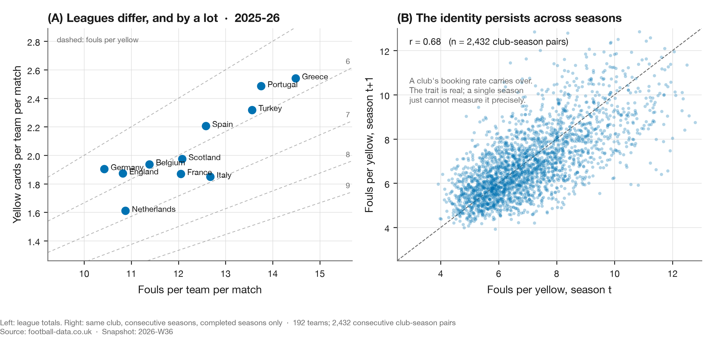
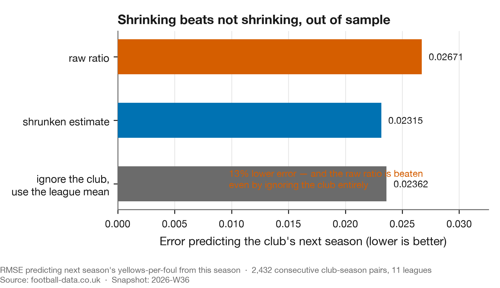

# How much of a booking index is real?

**Published:** 2026-09-02 · **Data:** `2026-W35` · **Claim level:** L3 (confirmed pattern)

---

## What the data says

A club's cards-per-foul rate over one season is mostly noise. **15% of the spread between clubs is
a real club property**; the other 85% is the Poisson accident of one season's bookings.

That is enough to be worth measuring and not enough to rank on. A one-season rate is beaten as a
predictor of the same club's next season by ignoring the club entirely and using the league mean.

## Why this needs its own answer

[Study 02](../02-fouling-with-impunity/report.md) asked whether one club was being booked unusually
and found that one club of twenty-six separates from expectation after adjustment. That result is
uninterpretable on its own. If a booking index were pure noise, one club of twenty-six would
separate anyway, and it would be a different club next year.

So the prior question is whether the measure carries anything about a club at all. It is also the
question [study 03](../03-the-lever-nobody-pulls/report.md) opens by citing, which is the reason
this is its own report: the dependency was real and buried nine sections deep in a report about
something else.

## It carries over between seasons

Taking every pair of consecutive seasons a club played in the same league, 2,528 pairs across all
eleven leagues, the index in one season correlates with the index in the next at **r = +0.324**. It
is positive in **11 of 11 leagues**, ranging from +0.172 in Scotland to +0.427 in Italy.



Panel A is there because the between-league differences are large and real, and pooling this ratio
across leagues is the one thing `METHODS.md` §8 forbids outright — Phatak et al. (2021) document
Simpson's paradox on precisely this quantity. Panel B is the carry-over itself.

## The correlation needs a null before it means anything

A positive correlation between consecutive seasons is not by itself evidence of a club property.
Clubs differ in fixtures, in how often they foul, and therefore in how many cards they are exposed
to, and any of that could produce a correlation in a world where no club has a disciplinary trait
at all.

So resample it. Draw every club-season's cards from Poisson(expected), holding each club's
expectations and fixture list exactly as they were, and recompute the same correlation. Across
**2,000 draws the null reaches +0.056 at its most extreme**, against the observed +0.324.

The carry-over is not arithmetic. This is the sixth of the six attacks in `METHODS.md` §11, and
§11 records it killing two earlier findings in this project that had survived the other five.

## But it is small

Of the spread in club-season index values, **15% is a real club property** and the rest is
sampling noise. The true between-club standard deviation is **0.051**, so a club one standard
deviation better than average is booked about 5% below expectation.

Both halves matter, and they pull in opposite directions. A real, repeatable club effect exists,
which is why the measure is worth having. It is small and buried in noise, which is why a single
season's raw ratio is a bad way to find it.

Produced by `scripts/booking_persistence.py`, alongside
[`persistence.json`](persistence.json).

## The out-of-sample test, which is the part that stings



Take 2,432 consecutive club-season pairs and ask which estimate best predicts a club's *next*
season. Three candidates: the club's own raw ratio, a shrunken estimate, and the league mean with
the club ignored entirely.

The raw ratio is the worst of the three. A shrunken estimate beats it by **13%**, and **ignoring the
club and using the league mean beats it by 12%**.

A number computed from one season of a club's own matches carries less information about that
club's next season than not looking at the club at all.

That is the quantitative form of the objection to the claim study 02 started from. Not that the
ratio was computed wrongly, but that a ratio on that little data is dominated by noise, and the
right response to a noisy estimate is to pull it toward the mean rather than to rank on it.

Produced by `scripts/index_reliability.py`, alongside [`shrinkage.json`](shrinkage.json) and
[`phase.json`](phase.json).

## What transfers

**A ranking is only as meaningful as the reliability of the thing ranked, and reliability is
measurable before any ranking is published.** The beta-binomial prior sample size gives the
stabilisation point for free from the model already fitted: reliability is `n/(n + n₀)` where
`n₀ = α+β`.

The failure mode this rules out is specific and common. A league table of rates, sorted, with the
extremes discussed. If the metric's reliability at that sample size is low, the extremes are mostly
the clubs that got unlucky, and the discussion is about noise. The test costs one out-of-sample
comparison against the group mean, and if the group mean wins there is nothing to rank.

## Pressure tests

`METHODS.md` §11 attacks a finding on six fronts before it is published. Tabulated so an attack
never tried cannot pass as one tried and survived.

| Attack | Status | What happened |
|---|---|---|
| Specification | **run — survived** | The variance decomposition assumes cards are Poisson given expectation. That is the assumption the matched null then tests directly rather than asserting, which is why the null is the load-bearing part of this report. |
| Aggregation | **run — survived** | The unit is the club-season, which is the unit the claim is about. The pairing is within club and within division, so no part of the correlation comes from comparing clubs across leagues — forbidden here by §8 and by Phatak et al. |
| Adjustment coarseness | **run — survived** | The expectation behind the index is a continuous fit in pre-match strength rather than banded, after study 02 established that five bands under-correct the strongest clubs. |
| Prior work | **run — landed** | Split-half reliability and empirical-Bayes shrinkage are old, and Johnson, Murphy and Bower (2010) ask the stabilisation question for association football directly — though that record is a two-page conference abstract, so it establishes the question was asked rather than answered. This project spent a fortnight asserting no such literature existed; §4 of `METHODS.md` records the error. A second precedent, O'Donoghue and Ponting (2005), is named in `METHODS.md` but sits in `references/unverified.bib` because no DOI has been located, so it is not cited in support of anything here. |
| Baseline sufficiency | **run — survived** | The matched Poisson null above. Observed +0.324 against a null maximum of +0.056 over 2,000 draws. |
| Cross-sectional, few units | **not applicable** | The correlation is across 2,528 club-season pairs, not across a handful of aggregate units. The per-league breakdown is reported as eleven separate estimates rather than pooled. |

## Tri-anchor

| Leg | Source |
|---|---|
| **Data** | 58,013 completed-season matches across 11 leagues, 2000–2025, committed snapshot `2026-W35` |
| **Football literature** | Phatak, Rein and Memmert (2021) on Simpson's paradox in discipline ratios; Johnson, Murphy and Bower (2010) on stable performance profiles in football |
| **Data-science literature** | Efron and Morris (1975) on empirical Bayes; Brown (2008) on out-of-sample shrinkage in sport; Gelman et al. on partial pooling |

## References

Full entries, each with a resolvable DOI, in
[`references/references.bib`](../../references/references.bib). Every DOI is checked in CI.

## Open questions

**Does reliability differ by league?** The per-league correlations range from +0.172 to +0.427, and
that spread is not obviously all noise. A league where the index is more reliable would be the
right place to look for a genuine club effect, and none of the eleven has been tested against the
others.

**Does a club's index move when its manager does?** Study 02 tests this and cannot see an effect,
with between-manager variance accounting for about 12% of the spread in spell effects. That is a
null from insufficient power rather than a demonstrated absence, and this report's estimate of how
much of the index is real is what sets that power.

## Reproduce this

Everything runs offline from the committed snapshot.

```bash
uv sync --all-extras --dev

uv run python scripts/booking_persistence.py   # the carry-over and the matched null
uv run python scripts/build_persistence.py     # figure 1
uv run python scripts/index_reliability.py     # figure 2, the out-of-sample test

uv run pytest
```
