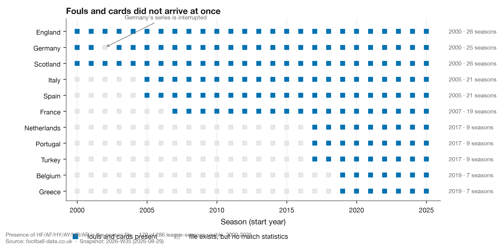
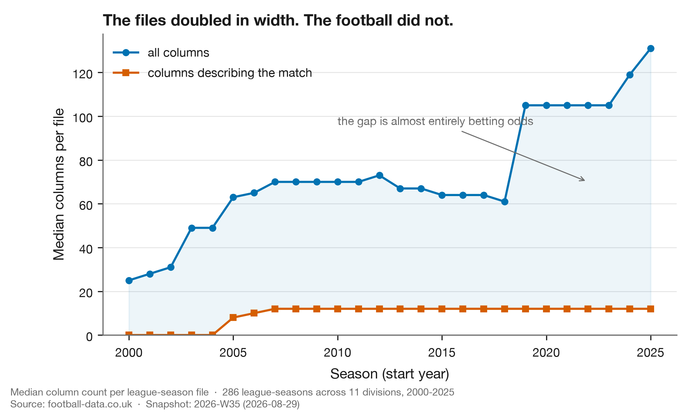

# Week 1 — What free football data can still tell you

**Published:** 2026-08-29 · **Snapshot:** `2026-W35` · **Claim level:** L1 (descriptive)

---

## The question, registered before the data was pulled

> Of the free, public football data that exists today, how much can actually support an
> analytical claim — and how much only looks like it can?

I wanted to start this project by measuring fouls and cards. Before writing any model, I checked
what data was available. That check turned out to be the more interesting result, so it is Week 1.

## Why this question, this week

Two things changed recently and neither is widely understood.

**FBref lost its Opta licence on 20 January 2026.** Expected goals, possession, passing,
progressive actions and defensive actions were removed site-wide — including from historical
archives. Pressures had already gone in the October 2022 provider switch. For years FBref was the
default free source for anyone doing public football analysis. Most of what made it useful is gone.

**What remains is smaller than it looks.** football-data.co.uk is now the most complete free
source of match-level football statistics. Its documentation describes a file that no longer
exists.

So rather than assume, I measured.

## Data

I probed the CSV header of every league-season file across **11 European top divisions** and
**26 seasons** (2000-01 to 2025-26) — **286 league-season files**. Each probe streams only the
first line, so the whole audit costs kilobytes.

The result is committed as a Parquet snapshot with a manifest recording the source URL, fetch
time, row count, schema hash and a SHA-256 of the bytes. Every number below is re-derivable from
that snapshot offline.

## Four findings

### 1. Match statistics were never backfilled



Fouls and cards arrived league by league across seventeen years. England and Scotland from
2000-01; Italy and Spain from 2005-06; France from 2007-08; the Netherlands, **Portugal** and
Turkey only from 2017-18; Belgium and Greece only from 2019-20.

**179 of 286 league-season files carry fouls and cards.** The other 107 exist, download fine, and
parse fine. They simply have no football in them.

This matters more than it sounds. A researcher pulling "twenty-six seasons of Portuguese football"
gets twenty-six files and nine seasons of data, with no error raised anywhere in that process.

### 2. Germany's series is interrupted, not late

Germany has fouls and cards in 2000-01 and 2001-02, **nothing in 2002-03**, and continuous
coverage from 2003-04. The same two early seasons are the only German files that carry a referee
column.

So Germany's record was richer twenty-five years ago than it was three years later, and was only
partly restored. A naive "first season with data" rule reports Germany as starting in 2003 and
silently discards two real seasons.

### 3. Referee coverage narrowed rather than grew

| League | Referee named |
|---|---|
| England | 2000–2025, continuous |
| Scotland | 2000–2025, except 2012-13 |
| Germany | 2000–2001 only |
| Italy | 2005–2006 only |
| Spain, France, Portugal, Netherlands, Belgium, Turkey, Greece | never |

Two associations had it and lost it. This is a hard constraint on what can be studied: the
disciplinary literature is unanimous that referee identity is a first-order confounder — Dawson et
al. (2007) find significant referee-to-referee inconsistency in card issuance — and in nine of
eleven leagues we cannot observe it at all.

### 4. The files doubled in width while the football stayed flat



Median columns per file went from 25 in 2000 to **131 in 2025**. Columns that describe what
happened in the match went from 0 to **12**, and have not moved since 2007.

Everything else is betting odds.

There is no conspiracy here — the site is explicitly a betting-data resource and has never claimed
otherwise. But it is a precise illustration of a general pattern: **a data source grows in the
direction its users pull it**, and if you are not the paying use case, your columns are the ones
that stop being maintained. Offsides, woodwork and bookings points were all present in 2000-01 and
dropped. Free-kicks-conceded survived to 2017-18. All four are still in the documentation today.

## What this means for the project

- The analytic window is **per league, not global**. Portugal supports nine seasons of discipline
  analysis, England twenty-six.
- Referee effects can be estimated directly in England and Scotland only. Everywhere else they
  must be *conditioned out* — which is possible, because both teams in a match face the same
  referee, so a within-match comparison removes referee strictness exactly without ever observing
  it. That is the model this project will use, and it exists because of a data constraint rather
  than a statistical preference.
- Any metric depending on possession, pressures, passing or event location is **not available**
  from free sources for current seasons. Not difficult — unavailable. That list is in the README
  so no future contributor builds on a column that does not exist.

## Confounders and limits

This is an audit of **column presence**, not data quality. A column being present does not mean it
is correct, complete, or consistently defined across leagues. Two known definitional traps already
identified: English and Scottish yellow-card counts exclude the first yellow of a second-bookable
offence, while other countries count both; and the yellow-card column counts *all* yellows —
dissent, time-wasting, bench cards — while the natural denominator for a card rate is fouls alone.

I have not verified row-level completeness within files. That is a separate audit, and it is next.

## The data lesson

**A file that downloads is not a file that answers your question, and nothing in your pipeline will
tell you the difference.**

Every one of those 107 empty league-seasons returns HTTP 200, parses without warning, and yields a
DataFrame. The failure is silent, and it is silent in exactly the way that matters: you get a
result, it looks plausible, and it is built on nothing.

The general form of this is a dependency you did not know you had, maintained by someone with no
obligation to your use case, changing on a schedule you do not control. FBref's users discovered
this in January. This is why provenance metadata is not bureaucracy: a schema hash and a row count
per fetch turn a silent failure into a loud one.

**A worked example from this very report.** The bibliography below is checked in CI by resolving
every DOI through content negotiation and comparing the registered title against the one claimed.
On its first run it failed — on a reference I had written myself. I had recorded the DOI for the
Phatak et al. paper by construction rather than by looking it up, and `10.2478/hukin-2021-0102`
registers a paper about circuit training in prepubertal boys. The real one is `-0095`.

A fabricated citation is easy to catch. A **real** identifier pointing at the wrong work is not,
and it is precisely what you get from any process that half-remembers a reference instead of
checking it. The check stays in CI.

## Tri-anchor

Nothing is published here without all three.

| Anchor | Source |
|---|---|
| **Data** | This project's own audit of 286 league-season files, snapshot `2026-W35`, committed |
| **Football** | Dawson et al. (2007) on referee inconsistency; Phatak et al. (2021) on why discipline metrics are inseparable from league context |
| **Data science** | Gebru et al. (2021), *Datasheets for Datasets*; Wilkinson et al. (2016), FAIR principles |

## References

- Dawson, P., Dobson, S., Goddard, J. & Wilson, J. (2007). Are Football Referees Really Biased and
  Inconsistent? *JRSS-A* 170(1), 231–250. [doi:10.1111/j.1467-985X.2006.00451.x](https://doi.org/10.1111/j.1467-985X.2006.00451.x)
- Gebru, T. et al. (2021). Datasheets for Datasets. *CACM* 64(12), 86–92. [doi:10.1145/3458723](https://doi.org/10.1145/3458723)
- Phatak, A., Rein, R. & Memmert, D. (2021). The Dirty League. *J. Human Kinetics* 80, 263–276.
  [doi:10.2478/hukin-2021-0095](https://doi.org/10.2478/hukin-2021-0095)
- Wilkinson, M. D. et al. (2016). The FAIR Guiding Principles. *Scientific Data* 3, 160018.
  [doi:10.1038/sdata.2016.18](https://doi.org/10.1038/sdata.2016.18)

## Reproduce this

```bash
git clone https://github.com/vidigalp/tactical-football-analytics
cd tactical-football-analytics
uv sync --all-extras --dev

# Figures and facts, entirely from the committed snapshot — no network needed
uv run python scripts/build_week01.py

# Re-run the audit against the live site
uv run python scripts/run_audit.py --from 2000 --to 2025
```

## Next

The row-level completeness audit, then the first properly powered discipline model — England and
Scotland with referee effects estimated directly, everywhere else with referee conditioned out
within match.
