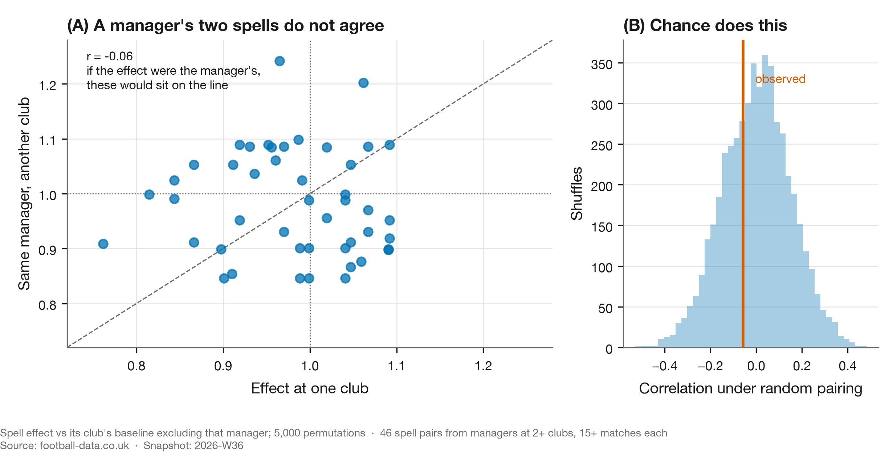
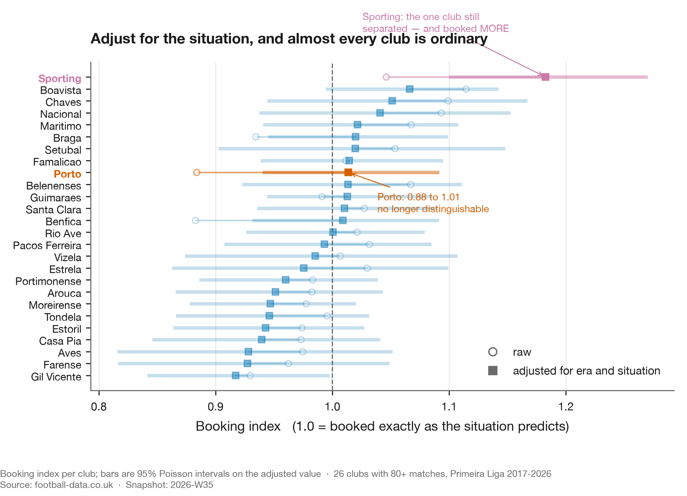
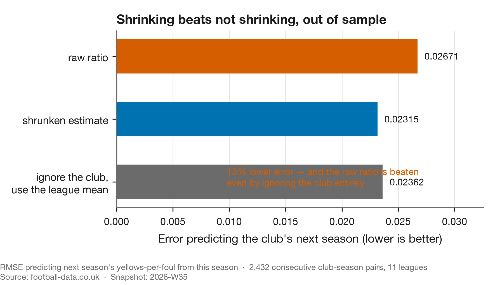

# Week 2 — A club that fouls with impunity, and the three ways I was wrong about it

**Published:** 2026-08-30 · **Snapshot:** `2026-W35` · **Claim level:** L2 (hypothesis, adjusted)

---

## What the data says

Across eleven European leagues, how often a team is booked per foul it commits depends mostly on
how strong that team was expected to be that afternoon. Heavy underdogs are booked more. Heavy
favourites are booked less. The gradient is monotone in all eleven leagues and involves no club
identity at all.

In the Portuguese league, once you account for that, for the era and for the referee who was
actually appointed, one club of twenty-six is booked measurably more than expected. It is Sporting,
at 1.18. Porto sit at 0.99 and Benfica at 1.00, both indistinguishable from average.

A post had gone around implying Porto were being favoured by referees. That is where the question
came from, and it is the last time the post appears here. The claim is the object of study; the
person who made it is not, so it is neither linked nor named. See [`EDITORIAL.md`](../../EDITORIAL.md).

## The pre-registered question

> Is there a measurable difference in how often a given club is booked, relative to the fouls it
> commits?

Written before the data was pulled. What follows reports what happened, including the parts where
the answer changed under its own tests.

## The metric

**Booking index** `LITERATURE-adjacent, COINED in this form`. Yellow cards received, divided by
yellow cards expected from the team's own foul count. An index of 1.0 means booked exactly as
often as the fouls imply.

The underlying quantity — cards conditioned on fouls — is standard. Phatak et al. (2021) use
fouls-per-card across five leagues. The name and the specific expectation model here are mine, and
neither appears in the literature under this label. Treating it as an established measure would be
a mistake.

## The first answer, which looked good and was wrong

Porto's raw booking index comes out at **0.884**. Comfortably below 1.0, interval excluding it.
Benfica sits at 0.883. On its face, two clubs booked around 12% less than their fouls imply.

That is roughly the shape the original claim predicted. It is also wrong three times over.

## Wrong (1): most of it is being the favourite


Booking rate per foul depends heavily on how strong you were expected to be in that specific
match. In Portugal, the league the question was about and the one the figure shows, a heavy
underdog is booked at **1.122** times its foul count and a heavy favourite at **0.851**. A 32%
swing, with no club identity involved.

The pattern is not Portuguese. It is monotone in all eleven leagues, median heavy underdog 1.112
against median heavy favourite 0.865.

Dominant clubs are favourites most weeks. So roughly half of Porto's apparent leniency was being
the better side, which they share with every strong club in Europe.

## Wrong (2): the expectation model was misspecified

The expectation assumed cards are proportional to fouls: *expected = rate × fouls*. They are not.

Fitting `cards = a + b × fouls` per league-season gives an intercept worth 13% to 47% of mean
cards, depending on the competition. Observed cards per foul falls monotonically from 0.195 at six
fouls to 0.127 at eighteen.

That intercept is interpretable. It is the cards that have nothing to do with your foul count:
dissent, delaying the restart, entering the field of play, simulation, plus whatever the data feed
does or does not record as a foul. In Greece and Italy it is nearly half of all cards.

Forcing the line through the origin inflates every low-foul team and deflates every high-foul team,
with no behaviour involved. A test on synthetic teams with identical card processes shows the
proportional model inventing a gap of over 0.10 between them.

Dominant clubs foul less than average. The model was flattering exactly the clubs the finding was
about.

## Wrong (3): the effect is not the club's

This is the one that changed the conclusion, and the test is embarrassingly cheap. Compute the same
index for the **opponents**.

| | |
|---|---|
| corr(club strength, **own** adjusted index) | **+0.486** |
| corr(club strength, **opponents'** index) | **+0.284** (p = 6×10⁻⁶) |
| corr(own index, opponents' index) | +0.115 (p = 0.07) |

When a dominant club plays, the other team is booked more per foul too, and the two are close to
independent. A club-level story predicts the second correlation is zero. It is not.

The within-club version is cleaner still. Holding the club fixed and splitting its matches by
opponent quality:

| Opponent | Booking index |
|---|---|
| Weakest third | 0.984 |
| Middle third | 0.993 |
| **Strongest third** | **1.025** |

65% of 246 clubs are booked more per foul when they face better opposition. Porto's opponents run
at 1.155, Celtic's at 1.057.

So the correct statement is not *"dominant clubs are booked more."* It is:

> Cards per foul scale with the quality of the fixture, for both teams.

A club's own quality is half of that fixture quality, so strong clubs genuinely do see a higher
rate. They are not being singled out. They are playing in higher-quality matches, and those
matches produce more cards per foul.

## If not the club, then the manager?



The natural next candidate. Managers set how a side presses and how it fouls, and Portuguese clubs
change them often enough to test it: take every manager who worked at two or more clubs, measure
each spell against that club's own baseline excluding them, and see whether the two spells agree.

They do not. Across 46 spell pairs the correlation is **r = −0.063**, and a permutation test that
reshuffles which spell belongs to which manager gives **p = 0.673**. The observed value sits in the
middle of the null. A manager who runs a disciplined side at one club is no more likely than chance
to do it at the next.

Between-manager variance accounts for about 8% of the spread in spell effects, which is small
enough that the honest reading is that this data cannot see a manager effect, rather than that none
exists. Either way, the club-level story does not become a manager-level story.

## Wrong (4), sort of: someone got there first

Dawson, Dobson, Goddard and Wilson published a gradient in cards by team strength in 2007
(*JRSS-A* 170(1)), on 2,660 Premier League matches, with a Nash-equilibrium model of aggression.
Their reduced form is a subset of the one used here.

What may be new is conditioning on fouls: asking not "who gets more cards" but "who gets more
cards for the same number of fouls". Rediscovering a known result on twenty-two times the data is
worth doing. Presenting it as new is not.

## So: was the club being favoured?

On this measure, no.

Portugal has no referee data in the standard source, so we assembled it. 2,737 match-official rows
across ten seasons, 98.4% joined to our matches and validated on scorelines rather than names.
Portuguese referees vary as much as English ones, with booking multipliers from 0.76 to 1.32 among
those with 40+ matches, but that variation is not concentrated on anyone. Every club's mean referee
draw falls between 0.979 and 1.019.

Adjusting for era, match situation and the actual official on the pitch:

| Club | Booking index | 95% interval |
|---|---|---|
| **Sporting** | **1.183** | [1.100, 1.271] |
| Benfica | 1.001 | [0.923, 1.084] |
| Porto | 0.989 | [0.916, 1.067] |

Porto sit at 0.989, indistinguishable from average. One club of twenty-six separates from
expectation, and it is not the one in the original claim.



The figure shows the era-and-situation step only, which is why Porto reads 1.01 there against 0.99
in the table: the referee adjustment moves them slightly further down. The shape is the point.
Almost every club that looked unusual on the raw index stops looking unusual once the situation is
accounted for, and the hollow-to-solid movement is the size of that correction.

### The multiplicity check, which is where most of these die

Testing twenty-six clubs and reporting the extreme one is how you manufacture a finding. Two clubs
clear an uncorrected p < 0.05, which is roughly what twenty-six coin flips would give you.

Under a Benjamini–Hochberg screen at FDR 0.10, one survives:

| Club | Index | raw p | BH-adjusted | Bonferroni |
|---|---|---|---|---|
| Sporting | 1.183 | 0.00001 | **0.0002** | **0.0002** |
| Gil Vicente | 0.917 | 0.044 | 0.567 | 1.000 |
| Boavista | 1.066 | 0.073 | 0.628 | 1.000 |

Gil Vicente is the one a naive threshold would have published. Sporting survives Bonferroni too,
which is the conservative correction and not one this result needed.

### What this cannot say

It measures yellow cards relative to fouls committed and nothing else. It says nothing about
penalties given or denied, offside calls, disallowed goals, red cards specifically, added time, or
whether any individual decision was correct. If "favoured" means those things, this analysis is
silent on it and should not be quoted as though it were not.

A high index is also not misconduct. Sporting commit fouls that draw cards more often than their
foul count predicts. Why is a separate question this data cannot answer.

## The data lesson

A result is not ready because it is significant. It is ready when a serious attempt to destroy it
has failed.

Three attacks were run here. Two landed.

**Aggregation.** Does the effect live at the level you are attributing it to? Computing the same
metric for the other party takes twenty lines and reframed the entire finding.

**Specification.** What does the model assume that the data might not support? The assumptions that
look like arithmetic are the dangerous ones. *Expected = rate × fouls* looks like a definition. It
is a claim, and it is false.

**Adjustment coarseness.** This one did not land. Five strength bands under-corrected the strongest
clubs, so it was redone as a continuous fit. The association strengthened.



There is a harder version of the same lesson. Taking 2,432 consecutive club-season pairs across the
eleven leagues and asking which estimate best predicts a club's next season, the raw ratio is the
worst of three. It is beaten by a shrunken estimate by 13%, and it is beaten by ignoring the club
entirely and using the league mean. A number computed from one season of a club's own matches
carries less information about that club's next season than not looking at the club at all.

That is the quantitative form of the objection to the original claim. Not that the ratio was
computed wrongly, but that a ratio on that little data is dominated by noise, and the correct
response to a noisy estimate is to pull it toward the mean rather than to rank on it.

The version that transfers: when a metric is an average over a group, ask whether the effect
belongs to the group or to the situations the group is in. Cohorts, segments, cost centres, model
slices. The arithmetic is identical and so is the error.

## Tri-anchor

| Anchor | Source |
|---|---|
| **Data** | 58,150 matches across 11 leagues, 2000–2026, committed snapshot `2026-W35`, plus 2,737 Portuguese match officials |
| **Football** | Dawson et al. (2007) on referee inconsistency and the strength gradient; Phatak et al. (2021) on fouls-to-cards across leagues |
| **Data science** | Efron & Morris (1975) on shrinkage; Benjamini & Hochberg (1995) on multiplicity |

## References

- Dawson, P., Dobson, S., Goddard, J. & Wilson, J. (2007). Are Football Referees Really Biased and
  Inconsistent? *JRSS-A* 170(1), 231–250. [doi:10.1111/j.1467-985X.2006.00451.x](https://doi.org/10.1111/j.1467-985X.2006.00451.x)
- Phatak, A., Rein, R. & Memmert, D. (2021). The Dirty League. *J. Human Kinetics* 80, 263–276.
  [doi:10.2478/hukin-2021-0095](https://doi.org/10.2478/hukin-2021-0095)
- Efron, B. & Morris, C. (1975). Data Analysis Using Stein's Estimator. *JASA* 70(350), 311–319.
  [doi:10.1080/01621459.1975.10479864](https://doi.org/10.1080/01621459.1975.10479864)
- Benjamini, Y. & Hochberg, Y. (1995). Controlling the False Discovery Rate. *JRSS-B* 57(1),
  289–300. [doi:10.1111/j.2517-6161.1995.tb02031.x](https://doi.org/10.1111/j.2517-6161.1995.tb02031.x)

## Open questions

**Sporting.** The one club still separating, at 1.183 across three managers and with no unusual
referee draw. Nobody was arguing about Sporting, which is part of why it is interesting.

**Absolute versus relative quality.** Our strength measure is standardised within league, so a
Celtic–St Mirren fixture scores as "high quality" on the same scale as Barcelona–Getafe. If the
real driver is absolute quality, that would explain why the gradient varies as much as it does
between leagues. Testable with UEFA country coefficients, and next.

**What we cannot resolve at all.** Whether the same foul is punished more harshly in a bigger
match, or whether bigger matches simply contain more cardable fouls. Distinguishing those requires
foul-level video coding. That is the honest limit here.

## Reproduce this

```bash
uv run python scripts/build_discipline_story.py   # figures 1-4, and the club table
uv run python scripts/strength_effect.py          # the cross-league association
uv run python scripts/referee_decomposition.py
uv run python scripts/manager_travel.py
```
