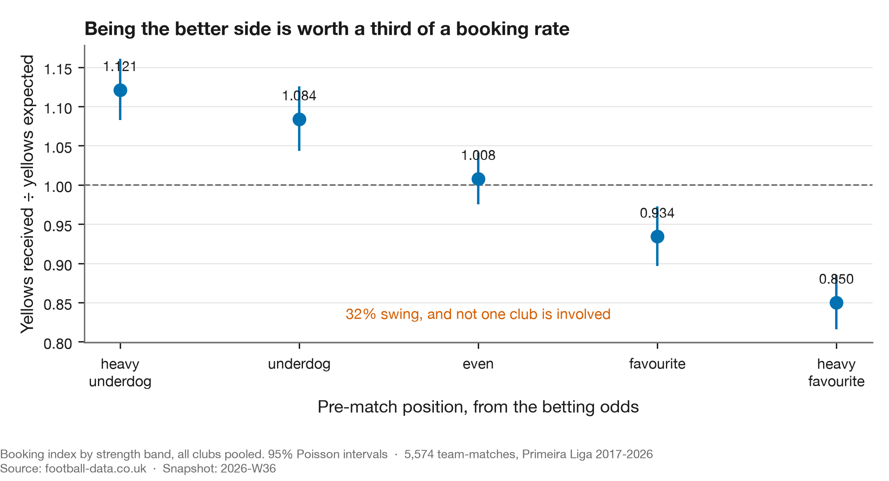

# Week 2 — A club that fouls with impunity, and the five ways I was wrong about it

**Published:** 2026-08-30 · **Snapshot:** `2026-W35` · **Claim level:** L2 (hypothesis, adjusted)

---

## The pre-registered question

> A viral post implied a Portuguese club was being favoured by referees. Is there a measurable
> difference in how often that club is booked, relative to the fouls it commits?

Written before the data was pulled. The analysis below reports what happened, including the parts
where the answer changed under its own tests.

I am not linking or naming the post. The claim is the object of study; the person who made it is
not. See [`EDITORIAL.md`](../../EDITORIAL.md).

Every number below is produced by `scripts/discipline_numbers.py` and written to
[`numbers.json`](numbers.json). Nothing is quoted here that is not in that file. That constraint
exists because of Wrong (5).

## The first answer, which looked good and was wrong

Porto's raw booking index — yellow cards received divided by cards expected from their foul count
at the league's own rate — comes out at **0.884**. Comfortably below 1.0. Benfica sits at 0.880,
Braga at 0.931, Sporting at 1.042.

On its face: two clubs booked around 12% less than their fouls imply. Roughly the shape the
original claim predicted.

It is also wrong, five times over.

## Wrong (1): most of it is being the favourite, and it applies to everyone



Booking rate per foul depends heavily on how strong you were expected to be *in that specific
match*. Across the eleven leagues, the median heavy underdog is booked at **1.112** times its foul
count; the median heavy favourite at **0.865**. The gradient is **monotone in 11 of 11 leagues**,
and no club identity is involved — this is every team, everywhere, purely as a function of the
role it is in that afternoon.

Dominant clubs are favourites most weeks. So a large part of Porto's apparent leniency is simply
being the better side, a property they share with every strong club in Europe.

The figure shows Portugal, because that is the league the question was about. The eleven-league
table is in `numbers.json`; Portugal is close to the median, at 1.122 and 0.851.

## Wrong (2): the expectation model was misspecified

The expectation assumed cards are proportional to fouls: *expected = rate × fouls*. They are not.

Fitting `cards = a + b × fouls` per league-season gives an intercept worth **13% to 47% of mean
cards**, depending on the competition. Observed cards per foul falls monotonically from **0.195**
at six fouls to **0.127** at eighteen.

That intercept is real and interpretable: it is the cards that have nothing to do with your foul
count — dissent, delaying the restart, entering the field of play, simulation — plus whatever the
data feed does or does not record as a foul. In Greece and Italy it is nearly half of all cards.

Forcing the line through the origin therefore **inflates every low-foul team and deflates every
high-foul team, with no behaviour involved.** A test on synthetic teams with identical card
processes shows the proportional model inventing a gap of over 0.10 between them.

Dominant clubs foul less than average. The model was flattering exactly the clubs the finding was
about.

Affine is enough, though. Adding a quadratic term improves RMSE by **0.44%**, so the curve is
straight over the range that matters and no further correction is warranted.

## Wrong (3): it is an asymmetry, not a shared shift

The cheap test is to compute the same index for the **opponents**, and it is decisive.

| | median across 11 leagues | consistency |
|---|---|---|
| corr(club strength, **own** booking index) | **−0.173** | negative in **11 of 11** |
| corr(club strength, **opponents'** booking index) | **+0.314** | positive in **11 of 11** |

The two have **opposite signs**. When a strong club plays, it is booked *less* per foul and the
other team is booked *more*. That is not both teams drifting the same way; it is the two sides of
one fixture moving apart.

The consequence is testable, and it holds: if the favourite's index falls by about as much as the
underdog's rises, the two should cancel when you aggregate the whole match. They do.
**Match-level fixture quality versus match booking index: median r = +0.002 across the eleven
leagues.** Nothing. The gradient exists strictly *within* a match, not between matches.

The within-club version is the cleanest evidence, because club identity is differenced out. Hold
the club fixed and split its own matches by opponent quality:

| Opponent | Booking index |
|---|---|
| Weakest third | **0.937** |
| Middle third | 0.996 |
| **Strongest third** | **1.086** |

Higher against better opposition in **11 of 11 leagues**, and for **76% of 326 clubs** with enough
matches to test. The same club, playing the same way, is booked differently depending on who is on
the other side — because against a stronger opponent it is closer to being the underdog.

So the correct statement is not *"dominant clubs are booked more"*, and it is not *"cards per foul
rise with the quality of the fixture"* either. It is:

> **Your booking rate per foul depends on your role in the fixture, not on who you are.**

A club's own quality determines its role most weeks. Strong clubs are usually favourites, so they
are usually booked less per foul. They are not being singled out; they are occupying the position
that gets booked less, and any club occupying it gets the same treatment.

## Wrong (4): someone got there first

Dawson, Dobson, Goddard and Wilson published a gradient in cards by team strength in 2007
(*JRSS-A* 170(1)), on 2,660 Premier League matches, with a Nash-equilibrium model of aggression.
Their reduced form is a subset of the one used here.

What may be new is **conditioning on fouls** — asking not "who gets more cards" but "who gets more
cards *for the same number of fouls*". Rediscovering a known result on 22 times the data is worth
doing. Presenting it as new is not.

## Wrong (5): a number reached the page without a script behind it

The first version of this study published the own-strength correlation as **+0.486**, positive,
and concluded from it that cards per foul rise with fixture quality *for both teams*. The true
value is **−0.173**, negative in every one of the eleven leagues. The sign was inverted, and the
conclusion was built on it.

Two things about how that happened are worth more than the correction itself.

**It contradicted this study's own opening paragraph.** Porto are a strong club and their index is
0.884, below 1.0. A negative correlation between strength and booking index is *required* by that
sentence. The two numbers could not both be true, they sat four paragraphs apart, and re-reading
the prose never caught it. Recomputing did, immediately.

**The figures were right; the prose was not.** `scripts/build_discipline_story.py` loads Portugal
only, and says so in a comment. The correlations quoted alongside came from exploratory work that
was never committed as code. So the study reported Portugal-only context numbers as though they
covered all eleven leagues, and quoted a correlation no script in the repository could produce.
`METHODS.md` already required that every published numeral trace to a run artifact. Nothing
enforced it.

Hence `scripts/discipline_numbers.py`, which now owns every figure in this report, and
`numbers.json`, which is committed beside it. The generalisable version: **a number without an
owner is a number nobody checked.** Provenance is not a filing convention, it is the mechanism by
which a sign error becomes findable.

## So: was the club being favoured?

On this measure, no.

Portugal has no referee data in the standard source, so we assembled it — 2,737 match-official rows
across ten seasons, 98.4% joined to our matches and validated on scorelines rather than names.
Portuguese referees vary as much as English ones (booking multipliers 0.76 to 1.32 among those with
40+ matches), but that variation is **not concentrated on anyone**: every club's mean referee draw
falls between 0.979 and 1.019.

Adjusting for era, match situation and the actual official on the pitch:

| Club | Booking index | 95% interval |
|---|---|---|
| **Sporting** | **1.183** | [1.100, 1.271] |
| Benfica | 1.001 | [0.923, 1.084] |
| **Porto** | **0.989** | [0.916, 1.067] |

One club of eighteen separates from expectation, and it is not the one in the original claim. Porto
sit at 0.989 — indistinguishable from average.

Note what the correction in Wrong (3) does and does not change here. The raw gradient runs in the
direction the original claim expected: favourites are booked less per foul. But it is a property of
the role, not the club, and once the role is adjusted for, the club that was accused is ordinary.
Getting the sign right made the finding *more* consistent with the claim's premise and no more
supportive of its conclusion.

### What this cannot say

It measures **yellow cards relative to fouls committed** and nothing else. It says nothing about
penalties given or denied, offside calls, disallowed goals, red cards specifically, added time, or
whether any individual decision was correct. If "favoured" means those things, this analysis is
silent on it, and should not be quoted as though it were not.

## The data lesson

**A result is not ready because it is significant. It is ready when a serious attempt to destroy it
has failed — including an attempt to destroy the arithmetic, not just the interpretation.**

Four attacks were run on the interpretation. Three landed:

- **Aggregation** — does the effect live at the level you are attributing it to? Computing the same
  metric for the *other* party takes twenty lines and reframed the entire finding.
- **Specification** — what does the model assume that the data might not support? The assumptions
  that look like arithmetic are the dangerous ones. *Expected = rate × fouls* looks like a
  definition. It is a claim, and it is false.
- **Baseline sufficiency** — what does a model with no team property in it already predict? This is
  what surfaced the match-level cancellation, and it is what turned "both teams" into "the two
  sides move apart".
- **Adjustment coarseness** — this one did not land. Five strength bands under-corrected the
  strongest clubs, so it was redone as a continuous fit. The association strengthened.

A fifth attack was not run at all, and should have been first: **does every number reproduce?** It
is the cheapest test available and the only one that catches a sign error, because a sign error
survives every argument about interpretation perfectly intact.

The generalisable version: when a metric is an average over a group, ask whether the effect belongs
to the group or to the situations the group is in. Cohorts, segments, cost centres, model slices —
the arithmetic is identical, and so is the error. Then check that the number you are arguing about
is the number your code produces.

## Tri-anchor

| Anchor | Source |
|---|---|
| **Data** | 58,150 matches, 11 leagues, 2000–2026, committed snapshot `2026-W35`; plus 2,737 Portuguese match officials |
| **Football** | Dawson et al. (2007) on referee inconsistency and the strength gradient; Phatak et al. (2021) on fouls-to-cards across leagues |
| **Data science** | Efron & Morris (1975) on shrinkage; Benjamini & Hochberg (1995) on multiplicity |

## References

- Dawson, P., Dobson, S., Goddard, J. & Wilson, J. (2007). Are Football Referees Really Biased and
  Inconsistent? *JRSS-A* 170(1), 231–250. [doi:10.1111/j.1467-985X.2006.00451.x](https://doi.org/10.1111/j.1467-985X.2006.00451.x)
- Phatak, A., Rein, R. & Memmert, D. (2021). The Dirty League. *J. Human Kinetics* 80, 263–276.
  [doi:10.2478/hukin-2021-0095](https://doi.org/10.2478/hukin-2021-0095)
- Efron, B. & Morris, C. (1975). Data Analysis Using Stein's Estimator. *JASA* 70(350), 311–319.
  [doi:10.1080/01621459.1975.10479864](https://doi.org/10.1080/01621459.1975.10479864)
- Benjamini, Y. & Hochberg, Y. (1995). Controlling the False Discovery Rate. *JRSS-B* 57(1),
  289–300. [doi:10.1111/j.2517-6161.1995.tb02031.x](https://doi.org/10.1111/j.2517-6161.1995.tb02031.x)

## Open questions

**Sporting.** The one club still separating, at 1.183 across three managers and with no unusual
referee draw. Nobody was arguing about Sporting, which is part of why it is interesting.

**Absolute versus relative quality.** Our strength measure is standardised within league, so a
Celtic–St Mirren fixture scores as "high quality" on the same scale as Barcelona–Getafe. If the
real driver is absolute quality, that would explain why the within-match gradient varies as much as
it does between leagues. Testable with UEFA country coefficients, and next.

**What we cannot resolve at all.** Whether the same foul is punished more harshly when committed by
the underdog, or whether underdogs simply commit more cardable fouls. Distinguishing those requires
foul-level video coding. That is the honest limit here.

## Reproduce this

```bash
uv run python scripts/discipline_numbers.py     # every number in this report
uv run python scripts/build_discipline_story.py # figures 1-4
uv run python scripts/referee_decomposition.py
uv run python scripts/manager_travel.py
```
