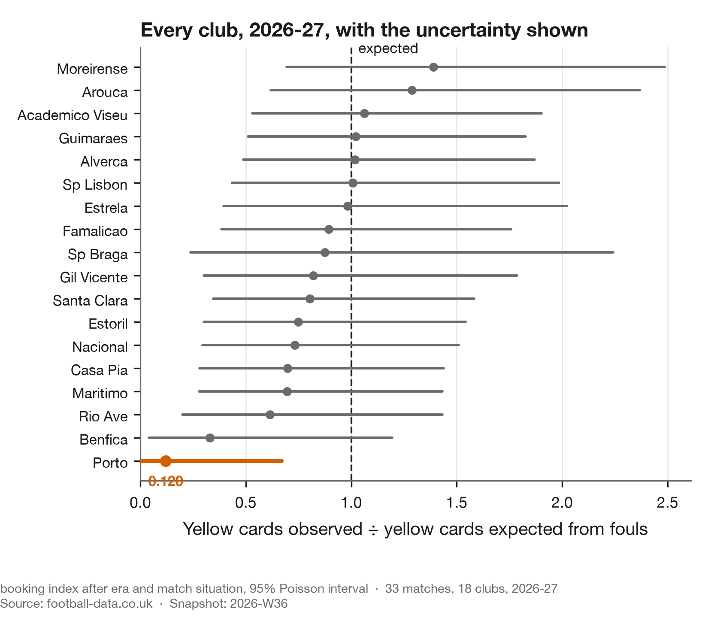

# The Portuguese season as it stands

**Updated:** 2026-09-02 · **Snapshot:** `2026-W36` · **Claim level:** L2 (hypothesis, pre-registered)

---

**This page changes.** Every other report here is dated and finished. This one tracks a season in
progress against a test that was sealed before the season started, and it will keep changing until
that test resolves on **15 November 2026**.

It exists separately for one reason: a live question with a resolution date does not belong inside
a dated study, because it makes that study permanently unfinished.

## What is being watched

[Study 02](../02-fouling-with-impunity/report.md) examined a viral claim that one Portuguese club
was being favoured by referees, and found the effect belonged to the fixture rather than the club.
Over ten completed seasons Porto's referee-adjusted booking index is **1.002** — average.

Then the current season started, and Porto took 58 fouls and one yellow card in four matches.

## Where it stands

Portugal through matchweek 4, snapshot `2026-W36`, 33 matches. Produced by
`scripts/season_status.py` alongside [`season_status.json`](season_status.json).



The intervals are the point. Four matches leaves every club's estimate wide enough to admit almost
anything, and the only reason one club reads as unusual is that it sits outside the spread of
seventeen others measured just as badly.

The situation multiplier comes from the completed seasons and is **deliberately not refitted here**:
heavy favourites 0.830, favourites 0.941, even 1.036, underdogs 1.085, heavy underdogs 1.103.
Letting four matches set their own baseline would defeat the point of having one — and study 02's
own pipeline made exactly that mistake elsewhere, which is recorded in `METHODS.md` §11.

| Club | Matches | Fouls | Yellows | Expected | Index | 95% interval | BH |
|---|---|---|---|---|---|---|---|
| **Porto** | 4 | **58** | **1** | 8.34 | **0.120** | [0.003, 0.668] | **0.081** |
| Benfica | 3 | 41 | 2 | 6.05 | 0.330 | [0.040, 1.193] | 1.000 |

Porto were heavy favourites in all four matches, so the situation adjustment already works in their
favour and takes the expectation from 10.04 down to 8.34. One yellow against that is still far out.
Across all 18 clubs, **1 survives a Benjamini–Hochberg screen at FDR 0.10**, and it is Porto at an
adjusted p of 0.081.

Note how close that is to the threshold. The era-only model gives an adjusted p of 0.017; adjusting
for the fact that Porto are favourites nearly quadruples it. Both numbers are reported because the
difference between them is the entire subject of Wrong (1) in study 02.

So it is not an ordinary early-season fluctuation. It survives the screen built to dismiss those.

## Why that is not yet a finding

It is four matches. The interval on Porto's index runs from 0.003 to 0.668, which admits almost
anything. And [study 04](../04-how-much-of-an-index-is-real/report.md) puts 85% of the spread in a
single season's booking index down to sampling noise — before you even get to a four-match sample.

A striking number arriving early and feeling conclusive is the exact situation the pre-registration
was written to handle.

## Could they just be fouling in safer places?

The most natural objection, and it has a ceiling.

[Study 03](../03-the-lever-nobody-pulls/report.md) measures an enormous card-risk gradient by pitch
position: **31.4%** of fouls in a team's own defensive fifth are carded against **8.9%** in the
attacking fifth. If a club fouled almost entirely upfield, it would be booked less for the same
number of fouls, and no adjustment used here accounts for that.

Two things make it an unlikely explanation, and neither requires measuring the Portuguese league.

**The gradient transfers; the club-to-club differences do not.** The gradient is present in
**5 of 5** big-five leagues, with the own-fifth risk running from **2.5** to **5.0** times the
attacking-fifth risk, so assuming Portugal has one too is safe. But clubs barely differ in where
they foul. Across 98 clubs the mean foul position spans 48 to 58 on a hundred-point pitch, a tenth
of the range the gradient covers, which is the whole finding of study 03.

**So the ceiling is small.** Taking each league's own gradient and finding the club whose actual
foul placement is most favourable under it, the best placement profile in the most generous of the
five leagues buys a **7.3%** reduction in card rate. Applying that ceiling here — deliberately
generous, since it is the best profile in the best league rather than anything measured in Portugal
— moves the expectation from 8.34 to **7.73** and the index from 0.120 to **0.129**. It accounts
for **1.1%** of an **88%** shortfall, and the two-sided Poisson p moves from 0.0045 to 0.0077.

Placement is not the explanation. That conclusion is robust precisely because it was tested at its
most favourable, and it would survive Portugal's gradient being twice as steep as any measured.

What it does not rule out is the thing no public data can see: whether the fouls themselves are
different in kind. Produced by `scripts/placement_ceiling.py` alongside
[`placement.json`](placement.json).

## The sealed test

[The pre-registration](https://github.com/vidigalp/tactical-football-analytics/blob/main/preregistrations/2026-08-30-porto-booking-index.md)
was written on 30 August, before this data existed. It counts Porto's yellow cards across
matchweeks 4 to 10:

| Count | Reading |
|---|---|
| 7 or fewer | real |
| 8 to 11 | ambiguous |
| 12 or more | noise |

**One matchweek is in and the count is zero.** It resolves on 15 November, whichever way that
falls.

The pre-registration also records its own contamination, which is the part worth reading: the
threshold that started this was chosen after seeing the data, and the document says so rather than
pretending otherwise.

## Pressure tests

`METHODS.md` §11, applied to the live claim rather than to a completed finding.

| Attack | Status | What happened |
|---|---|---|
| Specification | **run — survived** | The expectation is the frozen affine model, `1.1259 + 0.095491 × fouls`, fitted on completed seasons. Study 02's proportional-through-the-origin version is what Wrong (2) was about, and using it here would inflate exactly this club. |
| Aggregation | **run — survived** | The index is computed per club over its own matches, and the situation multiplier is estimated from the other ten seasons, so no part of this club's own live record sets its own baseline. |
| Adjustment coarseness | **skipped** | The situation multiplier is banded into five strength levels here rather than fitted continuously, because it is deliberately frozen from study 02's pre-registration. A continuous refit would be a better adjustment and a broken pre-registration. The banding under-corrects heavy favourites, which makes this reading conservative against the club. |
| Prior work | **not applicable** | No prior work is being extended. This is a status page against a sealed test. |
| Baseline sufficiency | **run — survived** | The Benjamini–Hochberg screen across all 18 clubs is the matched null: it asks what the most extreme club would look like if nothing were happening, and one club clears it. |
| Cross-sectional, few units | **not applicable** | No correlation across aggregate units is claimed. |

## Reproduce this

```bash
uv run python scripts/season_status.py
```
